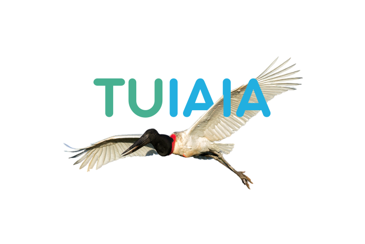
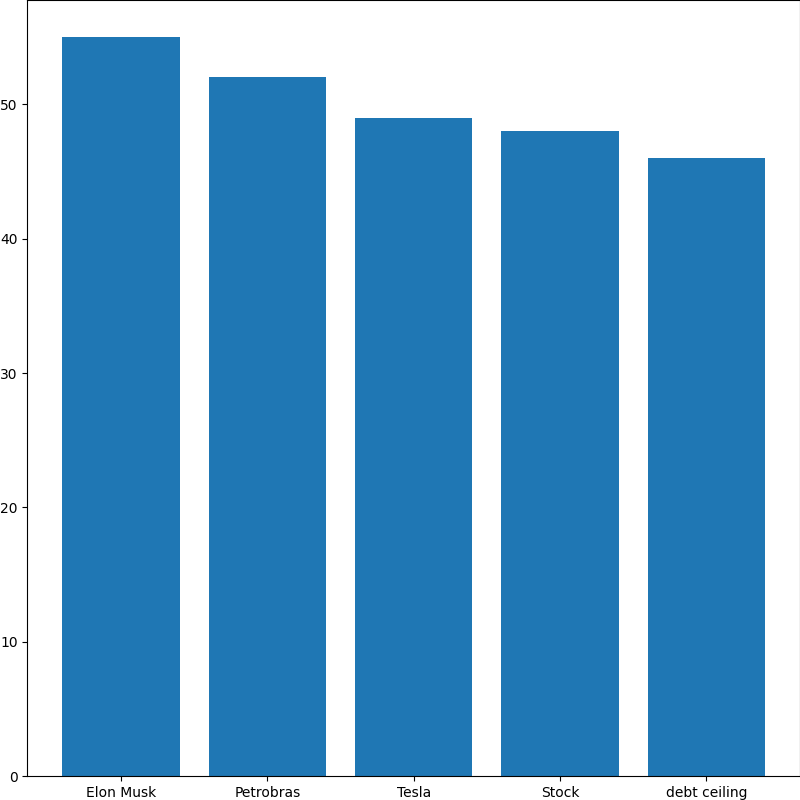

# API Tuiaia 
<p align="center">
<a href = "https://github.com/Tuiaia/backend/tree/main">
</a>
</p>
A API Tuiaia é uma ferramenta para classificar dados financeiros. Ela utiliza técnicas de aprendizado de máquina para analisar e categorizar informações financeiras, dividindo-as em sentimento, magnitude e impacto temporal, nesta ordem. Para executar a API, é necessário ter o MongoDB e o Redis instalados no seu sistema. Este documento fornece instruções sobre como instalar as dependências necessárias e como usar a API Tuiaia de forma eficiente.
## Instalação
Antes de executar a API Tuiaia, certifique-se de ter o MongoDB e o Redis instalados. Siga as instruções abaixo para instalar essas dependências:
    
### MongoDB
1. Acesse o site do MongoDB: https://www.mongodb.com/.
2. Baixe a versão apropriada do MongoDB para o seu sistema operacional.
3. Siga as instruções de instalação fornecidas no site do MongoDB para concluir o processo de instalação.


### Redis
1. Acesse o site do Redis: https://redis.io/.
2. Faça o download do software do Redis que corresponda ao seu sistema operacional.
3. Siga as instruções de instalação fornecidas no site do Redis para instalar o Redis no seu sistema.

## Executando a API Tuiaia

Após instalar o MongoDB e o Redis, você pode prosseguir para executar a API Tuiaia. Siga as etapas abaixo:

1. Clone o repositório da API Tuiaia no GitHub: https://github.com/tuiaia/backend.
2. Navegue até o diretório do projeto no seu terminal ou prompt de comando.
3. Instale as dependências necessárias executando o seguinte comando: "pip install -r requirements.txt"
4. Inicie o servidor da API executando o comando: 
```shell script
uvicorn app.main:app --host 0.0.0.0 --port 80
```
4. Para desenvolvedor, utilize
```shell script
uvicorn app.main:app --host 0.0.0.0 --port 80 --reload
```
5. A API Tuiaia estará em execução na sua máquina local em http://localhost:80

## Executando no docker
Uma maneira mais facil de fazer a execução, é através do docker, onde o ambiente já se encontra configurado para execução

Abra o terminal ou prompt de comando, navegue até o diretório onde o arquivo docker-compose.yml está localizado e execute o seguinte comando para iniciar os contêineres do MongoDB, Redis e da API:

```shell script
docker-compose up -d --build
```

Aguarde até que os contêineres sejam criados e iniciados.

# Endpoint da API

A API Tuiaia oferece os seguintes pontos de extremidade para interagir com o serviço de classificação de dados financeiros:

## POST /

Este ponto de extremidade permite classificar dados financeiros enviando uma solicitação POST com os dados financeiros no corpo da solicitação. A API processará os dados e retornará o resultado da classificação na seguinte ordem: sentimento, magnitude e impacto temporal. Também é obtido através da classificação as palavras que mais foram levadas em conta para a classificação. Para cada uma das classificações, é obtido 3 index, onde: 0 é negativo/baixo impacto/curto prazo, 1 é neutro/indeterminado/indeterminado e 2 é positivo/grande impacto/longo prazo

### Exemplo
Curl
```bash
curl -X 'POST' \
  'http://localhost:80/' \
  -H 'accept: application/json' \
  -H 'Content-Type: application/json' \
  -d '{
  "news": "Marisa vai fechar 91 lojas em plano de reestruturação; entenda a crise no varejo"
}'
```

Response Body
```bash
[
  {
    "prediction_index": 0,
    "prediction_probatility": "57.44%",
    "influential_words": [
      "reestruturação",
      "crise",
      "vai",
      "91",
      "fechar",
      "varejo",
      "plano",
      "entenda",
      "Marisa",
      "lojas"
    ]
  },
  {
    "prediction_index": 1,
    "prediction_probatility": "61.63%",
    "influential_words": [
      "crise",
      "Marisa",
      "entenda",
      "varejo",
      "reestruturação",
      "fechar",
      "plano",
      "91",
      "lojas",
      "vai"
    ]
  },
  {
    "prediction_index": 1,
    "prediction_probatility": "29.47%",
    "influential_words": [
      "crise",
      "reestruturação",
      "entenda",
      "Marisa",
      "91",
      "lojas",
      "varejo",
      "plano",
      "fechar",
      "vai"
    ]
  }
]
```

## GET /feed

Este ponto de extremidade permite a busca no banco de dados de todas as noticias já classificadas, onde é passado como parametro a data de inicio e fim da busca(por padrão retorna as noticias do dia)

### Exemplo
Request URL
```bash
http://localhost/feed?startdate=17%2F05%2F2023&enddate=17%2F05%2F2023
```

	
Response body
```bash
[
  {
    "_id": {
      "$oid": "64642b1c01ce198000bebb74"
    },
    "title": "Conheça 8 funções do Google Bard que o ChatGPT não tem",
    "url": "https://forbes.com.br/forbes-tech/2023/05/conheca-8-funcoes-do-google-bard-que-o-chatgpt-nao-faz/",
    "date": "17/05/2023",
    "font": "Forbes",
    "image": "https://forbes.com.br/favicon-32x32.png",
    "classification": {
      "sentiment": 0,
      "intensity": 2,
      "term": 0
    },
    "language": "ptbr"
  },
  {
    "_id": {
      "$oid": "64642b1c01ce198000bebb75"
    },
    "title": "As melhores universidades brasileiras, segundo ranking mundial",
    "url": "https://forbes.com.br/carreira/2023/05/as-melhores-universidades-brasileiras-segundo-ranking-mundial/",
    "date": "17/05/2023",
    "font": "Forbes",
    "image": "https://forbes.com.br/favicon-32x32.png",
    "classification": {
      "sentiment": 2,
      "intensity": 1,
      "term": 1
    },
    "language": "ptbr"
  }]
```

## GET /wordcloud

Este ponto de extremidade permite a criação de uma nuvem de palavras para melhor vizualização das noticias do momento no mercado financeiro, assim como no feed, é passado como parametro a data de inicio e fim da busca

### Exemplo
Request URL
```bash
http://localhost/wordcloud?startdate=17%2F05%2F2023&enddate=17%2F05%2F2023
```
Response body


## GET /barwordcloud

Seguindo a ideia da nuvem de palavras, esse ponto de extremidade permite fazer uma analise quantitativa das palavras que mais aparecem nas noticias atráves de um grafico de barras

### Exemplo
Request URL
```bash
http://localhost/barwordcloud?startdate=17%2F05%2F2023&enddate=17%2F05%2F2023
```
Response body


